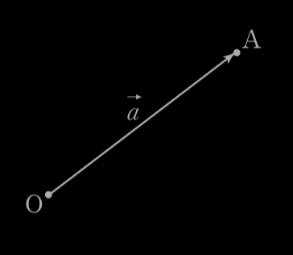
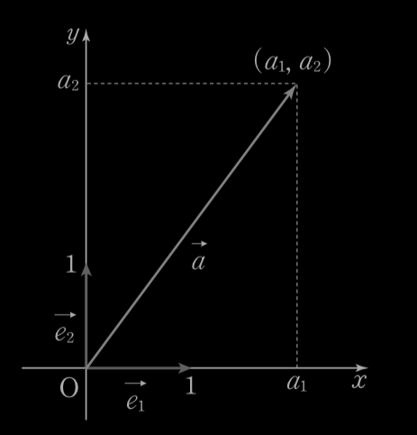

footer: 홈페이지: https://mathpractice.netlify.app 유튜브: https://www.youtube.com/@sogetsuj
slidenumbers: true

# 10. 평면벡터

## *2024 2학기 기하*

## **이한희**

---

---

## *평면벡터의 정의*

$$O$$부터 $$A$$까지

크기와 방향 

$$O$$를 고정하고 $$A$$의 좌표만으로 벡터를 표시

---

$$\vec{OA}=\vec{a}, \vec{OB}=\vec{b}$$

$$\vec{AB}=\vec{OB}-\vec{OA}$$

이므로 다음이 성립한다.

$$\vec{AB}=\vec{b}-\vec{a}$$

---

## 문제1

세 점 $$A, B, C$$의 위치벡터를 각각 $$\vec{a}, \vec{b}, \vec{c}$$라고 할 때, $$\vec{AB}-2\vec{BC}$$를 $$\vec{a}, \vec{b}, \vec{c}$$로 나타내시오.

---

$$\vec{AB}-2\vec{BC}$$

$$=(\vec{OB}-\vec{OA})-2(\vec{OC}-\vec{OB})$$

$$=-\vec{OA}+3\vec{OB}-2\vec{OC}$$

$$=-\vec{a}+3\vec{b}-2\vec{c}$$

---

## 예제1

두 점 $$A, B$$의 위치벡터를 각각 $$\vec{a}, \vec{b}$$라고 할 때, 선분 $$AB$$를 $$m:n$$ ($$m>0, n>0$$)으로 내분하는 점 $$P$$의 위치벡터 $$\vec{p}$$는

$$\qquad $$ $$\vec{p}=\dfrac{m\vec{b}+n\vec{a}}{m+n}$$

임을 보이시오.

---

## 예제1

두 점 $$A, B$$의 위치벡터를 각각 $$\vec{a}, \vec{b}$$라고 할 때, 선분 $$AB$$를 $$m:n$$ ($$m>0, n>0$$)으로 내분하는 점 $$P$$의 위치벡터 $$\vec{p}$$는

$$\qquad $$ $$\vec{p}=\dfrac{m\vec{b}+n\vec{a}}{m+n}$$

임을 보이시오.

---

$$\lvert \vec{AP}\rvert:\lvert \vec{AB}\rvert=m:(m+n)$$이므로

$$\vec{AP}=\dfrac{m}{m+n}\vec{AB}$$

이때 $$\vec{AP}=\vec{p}-\vec{a}, \vec{AB}=\vec{b}-\vec{a}$$이므로

---

$$\vec{p}-\vec{a}=\dfrac{m}{m+n}(\vec{b}-\vec{a})$$

따라서 $$\vec{p}=\vec{a}+\dfrac{m}{m+n}(\vec{b}-\vec{a})$$

$$=\dfrac{m\vec{b}+n\vec{a}}{m+n}$$

---

## 문제2

두 점 $$A, B$$의 위치벡터를 각각 $$\vec{a}, \vec{b}$$라고 할 때, 선분 $$AB$$를 $$m:n$$ ($$m>0, n>0, m\ne n$$)으로 외분하는 점 $$Q$$의 위치벡터 $$\vec{q}$$는

$$\qquad $$ $$\vec{q}=\dfrac{m\vec{b}-n\vec{a}}{m-n}$$

임을 보이시오.

---

## 문제2

두 점 $$A, B$$의 위치벡터를 각각 $$\vec{a}, \vec{b}$$라고 할 때, 선분 $$AB$$를 $$m:n$$ ($$m>0, n>0, m\ne n$$)으로 외분하는 점 $$Q$$의 위치벡터 $$\vec{q}$$는

$$\qquad $$ $$\vec{q}=\dfrac{m\vec{b}-n\vec{a}}{m-n}$$

임을 보이시오.

---

$$\text{i) }m>n$$ 일 때,

$$\lvert \vec{AQ}\rvert:\lvert \vec{AB}\rvert=m:(m-n)$$이므로

$$\vec{AQ}=\dfrac{m}{m-n}\vec{AB}$$

이때 $$\vec{AQ}=\vec{q}-\vec{a}, \vec{AB}=\vec{b}-\vec{a}$$이므로

$$\vec{q}-\vec{a}=\dfrac{m}{m-n}(\vec{b}-\vec{a})$$

---

따라서 $$\vec{q}=\vec{a}+\dfrac{m}{m-n}(\vec{b}-\vec{a})$$

$$=\dfrac{m\vec{b}-n\vec{a}}{m-n}$$

$$\text{ii) }m<n$$ 일 때도 같은 방법으로 성립.

---

## 문제3

두 점 $$A, B$$의 위치벡터를 각각 $$\vec{a}, \vec{b}$$라고 할 때, 다음 점의 위치벡터를 $$\vec{a}, \vec{b}$$로 나타내시오. 

(1) 선분 $$AB$$를 $$3:2$$로 내분하는 점 $$P$$

(2) 선분 $$AB$$를 $$2:1$$로 외분하는 점 $$Q$$

---

(1) $$\vec{p}=\dfrac{3\vec{b}+2\vec{a}}{3+2}=\dfrac{2}{5}\vec{a}+\dfrac{3}{5}\vec{b}$$

(2) $$\vec{q}=\dfrac{2\vec{b}-1\vec{a}}{2-1}=-\vec{a}+2\vec{b}$$

---

## 예제2

세 점 $$A, B, C$$의 위치벡터를 각각 $$\vec{a}, \vec{b}, \vec{c}$$라고 할 때, 삼각형 $$ABC$$의 무게중심 $$G$$의 위치벡터 $$\vec{g}$$는

$$\qquad$$ $$\vec{g}=\dfrac{\vec{a}+\vec{b}+\vec{c}}{3}$$

임을 보이시오. 

---

## 예제2

세 점 $$A, B, C$$의 위치벡터를 각각 $$\vec{a}, \vec{b}, \vec{c}$$라고 할 때, 삼각형 $$ABC$$의 무게중심 $$G$$의 위치벡터 $$\vec{g}$$는

$$\qquad $$ $$\vec{g}=\dfrac{\vec{a}+\vec{b}+\vec{c}}{3}$$

임을 보이시오. 

---

선분 $$BC$$의 중점을 $$M$$, 점 $$M$$의 위치벡터를 $$\vec{m}$$이라 하면

$$\vec{m}=\dfrac{\vec{b}+\vec{c}}{2}\ \cdots\cdots$$ ①

이때 삼각형 $$ABC$$의 무게중심 $$G$$는 선분 $$AM$$을 $$2:1$$로 내분하는 점이므로

$$\vec{g}=\dfrac{2\vec{m}+\vec{a}}{3}\ \cdots\cdots$$ ②

---

①을 ②에 대입하면 $$\vec{g}=\dfrac{2\times\dfrac{\vec{b}+\vec{c}}{2}+a}{3}=\dfrac{\vec{a}+\vec{b}+\vec{c}}{3}$$

---

## 문제5

삼각형 $$ABC$$의 무게중심을 $$G$$라고 할 때, 

$$\qquad \vec{GA}+\vec{GB}+\vec{GC}=\vec{0}$$

임을 보이시오.

---

네 점 $$A, B, C, G$$의 위치벡터를 각각 $$\vec{a}, \vec{b}, \vec{c}, \vec{g}$$라고 하면

$$\qquad \qquad \qquad \vec{g}=\dfrac{\vec{a}+ \vec{b}+ \vec{c}}{3}$$ 이므로

$$\vec{GA}+\vec{GB}+\vec{GC}=(\vec{a}-\vec{g})+(\vec{b}-\vec{g})+(\vec{c}-\vec{g})=\vec{a}+\vec{b}+\vec{c}-3\vec{g}$$

$$=\vec{a}+\vec{b}+\vec{c}-(\vec{a}+\vec{b}+\vec{c})=\vec{0}$$

---

## *평면벡터의 성분*

$$x$$좌표 $$\longrightarrow\ x$$성분

$$y$$좌표 $$\longrightarrow\ y$$성분

$$\vec{e_1}=(1, 0)$$ 가로로 몇 칸

$$\vec{e_2}=(0, 1)$$ 세로로 몇 칸

$$\vec{a}=(a_1, a_2)=a_1\vec{e_1}+a_2\vec{e_2}$$

---

## 스스로 확인하기

점 $$A(2, -3)$$의 위치벡터를 $$\vec{a}$$라고 할 때, 벡터 $$\vec{a}$$를 성분으로 나타내면 $$\vec{a}=(2, -3)$$이고, $$\vec{e_1}=(1, 0), \vec{e_2}=(0, 1)$$로 나타내면 $$\vec{a}=2\vec{e_1}-3\vec{e_2}$$이다. 

---

## 문제6

오른쪽 그림과 같은 세 벡터 $$\vec{a}, \vec{b}, \vec{c}$$에 대하여 다음 물음에 답하시오.

(1) $$\vec{a}, \vec{b}, \vec{c}$$를 성분으로 나타내시오. 

(2) $$\vec{a}, \vec{b}, \vec{c}$$를 $$\vec{e_1}=(1, 0), \vec{e_2}=(0, 1)$$로 나타내시오. 

---

## 문제6

오른쪽 그림과 같은 세 벡터 $$\vec{a}, \vec{b}, \vec{c}$$에 대하여 다음 물음에 답하시오.

(1) $$\vec{a}, \vec{b}, \vec{c}$$를 성분으로 나타내시오. 

$$\vec{a}=(2, 3), \vec{b}=(-3, 1), \vec{c}=(4, -2)$$

---

## 문제6

오른쪽 그림과 같은 세 벡터 $$\vec{a}, \vec{b}, \vec{c}$$에 대하여 다음 물음에 답하시오.

(2) $$\vec{a}, \vec{b}, \vec{c}$$를 $$\vec{e_1}=(1, 0), \vec{e_2}=(0, 1)$$로 나타내시오. 

$$\vec{a}=2\vec{e_1}+3\vec{e_2}, \vec{b}=-3\vec{e_1}+\vec{e_2}, \vec{c}=4\vec{e_1}-2\vec{e_2}$$

---

$$\vec{a}=(a_1, a_2)$$일 때, 원점 $$O$$와 점 $$A(a_1, a_2)$$에 대하여 $$\vec{a}=\vec{OA}$$이므로 벡터 $$\vec{a}$$의 크기는 선분 $$OA$$의 길이와 같다.

$$\lvert \vec{a}\rvert=\vec{OA}=\sqrt{{a_1}^2+{a_2}^2}$$

또, 두 벡터 $$\vec{a}=(a_1, a_2), \vec{b}=(b_1, b_2)$$에 대하여

$$\vec{a}=\vec{b} \iff a_1=b_1, a_2=b_2$$

---

## *벡터의 크기, 서로 같을 조건*

두 벡터 $$\vec{a}=(a_1, a_2), \vec{b}=(b_1, b_2)$$에 대하여

$$\qquad \lvert \vec{a}\rvert=\overline{OA}=\sqrt{{a_1}^2+{a_2}^2}$$

$$\vec{a}=\vec{b}\iff a_1=b_1,\ a_2=b_2$$

---

## 문제7

다음 벡터의 크기를 구하시오.

(1) $$\vec{a}=(-2, 3)$$

$$\qquad \lvert \vec{a}\rvert=\sqrt{(-2)^2+3^2}=\sqrt{13}$$

(2) $$\vec{b}=(1, -1)$$

$$\qquad \lvert \vec{b}\rvert=\sqrt{1^2+(-1)^2}=\sqrt2$$

---

## 문제8(한번 해보세요~)

두 벡터 $$\vec{a}=(3, n-2), \vec{a}=(m-3, 4-n)$$에 대하여 $$\vec{a}=\vec{b}$$일 때, 두 실수 $$m, n$$의 값을 구하시오.

답:$$m=6, n=3$$

---

## *평면벡터의 성분에 의한 연산*

$$\vec{a}=(a_1, a_2), \vec{b}=(b_1, b_2)$$ 를 $$\vec{e_1}=(1, 0), \vec{e_2}=(0, 1)$$으로 나타내면

$$\vec{a}=a_1\vec{e_1}+a_2\vec{e_2}, \vec{b}=b_1\vec{e_1}+b_2\vec{e_2}$$

$$=(a_1+b_1)\vec{e_1}+(a_2+b_2)\vec{e_2}$$

$$=(a_1+b_1, a_2+b_2)$$

$$\therefore$$ 각각 계산하면 된다. (뺄셈, 상수배도 마찬가지)

---

## 문제9

$$\vec{a}=(2, 1), \vec{b}=(0, -2), \vec{c}=(1, 2)$$일 때, 다음 벡터를 성분으로 나타내시오.

(1) $$\vec{a}+2\vec{b}-\vec{c}=(2, 1)+\big(2\times0, 2\times(-2)\big)-(1, 2)=(1, -5)$$

(2) $$2(\vec{a}-2\vec{b})-3(2\vec{a}-\vec{b})+\vec{c}=(-7, 0)$$

---

## 예제3

$$\vec{a}=(1, 0), \vec{b}=(1, 2), \vec{c}=(1, -2)$$일 때, $$\vec{c}=k\vec{a}+l\vec{b}$$를 만족시키는 두 실수 $$k, l$$의 값을 구하시오.

---

$$\vec{c}=k\vec{a}+l \vec{b}$$를 성분으로 나타내면

$$(1, -2)=k(1, 0)+l(1, 2)$$

$$=(k, 0)+(l, 2l)$$

$$=(k+l, 2l)$$

두 벡터가 서로 같을 조건에 의해

$$k+l=1, 2l=-2$$

$$\therefore\ k=2, l=-1$$

---

## 문제10(한번 해보세요~)

$$\vec{a}=(2, 1), \vec{b}=(3, -2), \vec{c}=(-6, 11)$$일 때, $$\vec{c}=k\vec{a}+l \vec{b}$$를 만족시키는 두 실수 $$k, l$$의 값을 구하시오. 

$$ k=3, l=-4$$

---

좌표평면 위의 두 점 $$A(a_1, a_2), B(b_1, b_2)$$에 대하여 평면벡터 $$\vec{AB}$$를 성분으로 나타내고, 그 크기를 구해보자.

$$\vec{OA}=(a_1, a_2), \vec{OB}=(b_1, b_2)$$이므로

$$\vec{AB}=\vec{OB}-\vec{OA}=(b_1, b_2)-(a_1, a_2)$$

---

$$=(b_1-a_1, b_2-a_2)$$

$$\lvert \overline{AB}\rvert=\sqrt{(b_1-a_1)^2+(b_2-a_2)^2}$$

---

## *평면벡터의 성분과 크기*

$$\vec{AB}=(b_1, b_2)-(a_1, a_2)$$

$$\lvert \overline{AB}\rvert=\sqrt{(b_1-a_1)^2+(b_2-a_2)^2}$$

---

## 문제11

두 점 $$A(-1, 2), B(2, -1)$$에 대하여 벡터 $$\overline{AB}$$를 성분으로 나타내고, 그 크기를 구하시오. 

$$\vec{AB}=\big(2-(-1), -1-2)\big)=(3, -3)$$

$$\lvert \vec{AB}\rvert=\sqrt{3^2+(-3)^2}=3\sqrt2$$

