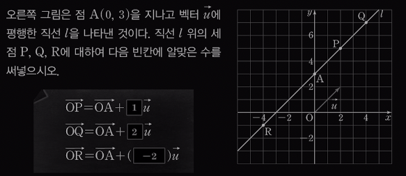
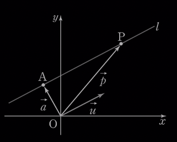
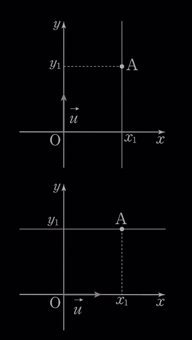
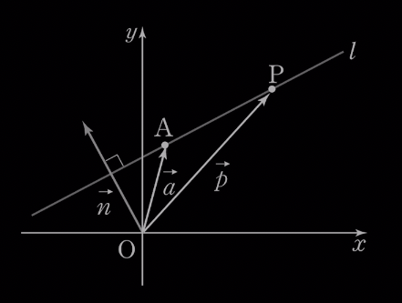

footer: 홈페이지: https://mathpractice.netlify.app 유튜브: https://www.youtube.com/@sogetsuj
slidenumbers: true
autoscale: false
slide-transition: false

# 12. 직선의 방정식

## *2024 2학기 기하*

## **이한희**

---

## **주어진 벡터에 평행한 직선의 방정식은 어떻게 구할까?**

---

$$\vec{AP}//\vec{u}$$이므로

$$\vec{AP}=t\vec{u}$$인 실수 $$t$$가 존재

$$\vec{OP}=\vec{OA}+\vec{AP}$$이므로

$$\vec{p}=\vec{a}+t\vec{u}$$

 

방향벡터

---

[.column]

$$\text{Let }\quad \vec{u}=(a, b), A(x_1, y_1), P(x, y)$$

$$\vec{a}=(x_1, y_1), \vec{p}=(x, y)$$

위 직선의 방정식은

$$(x, y)=(x_1, y_1)+t(a, b)$$

$$\qquad $$ $$=(x_1+at, y_1+bt)$$

[.column]

두 벡터가 서로 같을 조건에 의해

$$x=x_1+at, y=y_1+bt$$

$$ab\ne0$$일 때, 위 식은

$$\dfrac{x-x_1}{a}=\dfrac{y-y_1}{b}$$

---

## *직선의 방정식*

점 $$A(x_1, y_1)$$을 지나고 방향벡터가 $$\vec{u}=(a, b)$$인 직선의 방정식은

$$\qquad $$ $$\qquad $$ $$\qquad $$ $$\dfrac{x-x_1}{a}=\dfrac{y-y_1}{b}$$  (단, $$ab\ne0$$)

---

### *축과 평행한 직선의 방정식*

$$\qquad $$ $$a=0, b\ne0$$이면 $$x=x_1$$

     

$$\qquad $$ $$a\ne0, b=0$$이면 $$y=y_1$$

---

## 문제1.
다음 직선의 방정식을 구하시오.

[.column]

(1) 점 $$(-2, 3)$$을 지나고 방향벡터가 $$\vec{u}=(1, 2)$$인 직선

$$\qquad $$ $$\dfrac{x+2}{1}=\dfrac{y-3}{2}$$

$$\qquad $$ $$x+2=\dfrac{y-3}{2}$$

[.column]

(2) 점 $$(1, 2)$$를 지나고 직선 $$\dfrac{x-2}{3}=\dfrac{1-y}{2}$$에 평행한 직선

$$\qquad $$ $$\dfrac{x-1}{3}=\dfrac{y-2}{-2}$$

---

(3) 점 $$(1, 5)$$를 지나고 벡터 $$\vec{u}=(-1, 0)$$에 평행한 직선

$$ y=5 $$ 

---

## 예제1.
두 점 $$A(1, 3), B(2, -1)$$을 지나는 직선의 방정식을 벡터를 이용하여 구하시오.

[.column]

구하는 직선의 방향벡터는 

$$\vec{AB}=(2-1, -1-3)=(1, -4)$$

[.column]

이 직선이 점 $$A(1, 3)$$을 지나므로 직선의 방정식은 

$$\qquad $$ $$x-1=\dfrac{y-3}{-4}$$

---

## 문제2.(한번 해보세요~)
다음 두 점을 지나는 직선의 방정식을 벡터를 이용하여 구하시오. 

(1) $$A(5, 2), B(-1, 3)$$ $$\qquad \qquad$$ 답: $$\dfrac{x-5}{-6}=y-2$$

(2) $$A(1, -4), B(2, -1)$$ $$\qquad \qquad$$ 답: $$x-1=\dfrac{y+4}{3}$$

---

## **주어진 벡터에 수직인 직선의 방정식은 어떻게 구할까?**

점 $$A$$를 지나고 영벡터가 아닌 벡터 $$\vec{n}$$에 수직인 직선 $$l$$의 방정식

[.column]

$$\quad $$ $$\vec{AP}\cdot\vec{n}=0$$

$$\quad $$ $$(\vec{p}-\vec{a})\cdot\vec{n}=0$$

 

법선벡터

[.column]

---

[.column]

$$\text{Let }\vec{n}=(a, b), A(x_1, y_1), P(x, y)$$

$$(x-x_1, y-y_1)\cdot(a, b)=0$$

$$a(x-x_1)+b(y-y_1)=0$$

[.column]

$$\qquad $$ 

---

## *법선벡터를 이용한 직선의 방정식*

점 $$A(x_1, y_1)$$을 지나고 법선벡터가 $$\vec{n}=(a, b)$$인 직선의 방정식

$$\qquad $$ $$\qquad $$ $$\qquad $$ $$a(x-x_1)+b(y-y_1)=0$$

---

## 스스로 확인하기

점 $$(1, 2)$$를 지나고 법선벡터가 $$\vec{n}=(-1, 3)$$인 직선의 방정식은

$$\qquad $$ $$-(x-1)+3(y-2)=0$$

$$\qquad $$ $$\therefore\ x-3y+5=0$$

---

## 문제1. (한번 해보세요~)
다음 직선의 방정식을 구하시오.

(1) 점 $$(-3, -1)$$을 지나고 법선벡터가 $$\vec{n}=(2, 1)$$인 직선 

$$\qquad \qquad$$ $$2x+y+7=0$$

(2) 점 $$(-1, 2)$$를 지나고 벡터 $$\vec{n}=(1, -4)$$에 수직인 직선 

$$\qquad \qquad$$ $$x-4y+9=0$$

---

## *두 직선의 평행조건 수직조건*

방향벡터끼리 평행하면 두 직선도 평행

방향벡터끼리 수직이면 두 벡터도 수직

두 직선 $$l, m$$의 방향벡터가 각각 $$\vec{u}, \vec{v}$$일 때, 

$$l//m\iff\vec{u}//\vec{v}$$

$$l\perp m\iff\vec{u}\perp\vec{v}$$

---

## 예제2.
두 직선 $$l:\dfrac{x-1}{6}-\dfrac{y-2}{k},\ m:\dfrac{x}{2}=\dfrac{y-1}{3}$$에 대하여 다음을 구하시오.

(1) 두 직선 $$l, m$$이 서로 평행할 때, 상수 $$k$$의 값

(2) 두 직선 $$l, m$$이 서로 수직일 때, 상수 $$k$$의 값

---

두 직선 $$l, m$$의 방향벡터를 각각 $$\vec{u}, \vec{v}$$라 하면

[.column]

$$\vec{u}=(6, k), \vec{v}=(2, 3)$$

[.column]

(1) $$l // m$$이므로 $$\vec{u} // \vec{v}$$

$$\quad $$ $$(6, k)=t(2, 3)$$

$$\quad $$ $$6=2t, k=3t$$

$$\therefore\ t=3, k=9$$

[.column]

(2) $$l\perp m$$이므로 

$$\qquad $$ $$\vec{u}\perp\vec{v}$$

$$\quad $$ $$(6, k)\cdot(2, 3)=0$$

$$\quad $$ $$12+3k=0$$

$$\therefore\ k=-4$$

---

## 문제4.(한번 풀어보세요~)
두 직선 $$l:\dfrac{x-2}{k}=\dfrac{y-1}{3},\ m:\dfrac{x+1}{3}=\dfrac{1-y}{6}$$에 대하여 다음을 구하시오.

[.column]

(1) 두 직선 $$l, m$$이 서로 평행할 때, 상수 $$ k $$의 값

$$(k, 3)=-2(3, 6) \therefore\ k=-\dfrac{3}{2}$$

[.column]

(2) 두 직선 $$l, m$$이 서로 수직일 때, 상수 $$k$$의 값

$$3k+3\times(-6)=0 \therefore\ k=6$$
