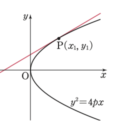

# 8.이차곡선과 접선
## 개념열기

포물선 $$y^2=4px$$ 위의 점 $$P(x_1, y_1)$$
에서의 접선의 방정식

(1) $$x_1\ne0$$일 때, 접선의 기울기를 $$m(\ne0)$$이라 하자.

구하는 접선의 방정식은 

$$y-y_1=m(x-x_1)$$

$$y=m(x-x_1)+y_1\quad\cdots\cdots$$①

또 포물선 $$y^2=4px$$에 접하고 기울기가 $$m$$인 접선의 방정식은 

$$y=mx+\frac{p}{m}\quad\cdots\cdots$$②

이므로 ①과 ②에서 

$$m(x-x_1)+y_1=mx+\frac{p}{m}$$

$$x_1m^2-y_1m+p=0$$

이때 $${y_1}^2=4px_1$$이므로

$$m=\frac{y_1\pm\sqrt{{_1^2-4px_1}}{2x_1}=\frac{y_1}{2x_1}=\frac{2p}{y_1}$$

이 식을 ①에 대입하여 정리하면

$$y_1y=4y(x-x_1)+{y_1}^2$$

이고, $${y_1}^2=4px_1$$이므로

$$y_1y=4y(x+x_1)$$

(2) $$x_1=0$$일 때, 접선의 방정식은 $$x=0$$이다. 

따라서 접선의 방정식 $$y_1y=4p(x+x_1)$$은 이 경우에도 성립한다.

그림

(1), (2) 에서 포물선 $$y^2=4px$$ 위의 점 $$P(x_1, y_1)$$에서의 접선의 방정식은 

$$y_1y=2p(x+x_1)$$

---

## 예제3. 쌍곡선 $$\frac{x^2}{a^2}-\frac{y^2}{b^2}=1$$ 위의 점 $$P(x_1, y_1)$$에서의 

## 접선의 방정식은 $$\frac{x_1x}{a^2}-\frac{y_1y}{b^2}=1$$임을 보이시오.

**이 문제도 설명할 것**

(1) $$y_1\ne0$$일 때, 접선의 기울기를 $$m$$이라고 하면 구하는 접선의 방정식은

$$y=m(x-x_1)+y_1\quad\cdots\cdots$$①

쌍곡선 $$\frac{x^2}{a^2}-\frac{y^2}{b^2}=1$$에 접하고 기울기가 $$m$$인 접선의 방정식

$$y=mx\pm\sqrt{a^2m^2-b^2}\quad$$(단, $$a^2m^2>b^2$$)$$\quad\cdots\cdots$$②

①, ②에서 

$$m(x-x_1)+y_1=mx\pm\sqrt{a^2m^2-b^2}$$

$$y_1-mx_1=\pm\sqrt{a^2m^2-b^2}$$

양변을 제곱하여 정리하면

$$({x_1}^2-a^2)m^2-2x_1y_1m+(b^2+{y_1}^2)=0$$

이때 $$\frac{{x_1}^2}{a^2}-\frac{{y_1}^2}{b^2}=1$$ 이므로

$$\left(\frac{ay_1}{b}m\right)^2-2x_1y_1m+\left(\frac{bx_1}{a}\right)^2=0$$, $$\left(\frac{ay_1}{b}m-\frac{bx_1}{a}\right)^2=0$$

따라서 $$m=\frac{b^2x_1}{a^2y_1}$$

이것을 ①에 대입하고 양변에 $$\frac{y_1}{b^2}$$을 곱하여 정리하면

$$\frac{x_1x}{a^2}-\frac{y_1y}{b^2}=1$$

(2) $$y_1=0$$일 때, 접선의 방정식은

$$x=a$$ 또는 $$x=-a$$

따라서 접선의 방정식 $$\frac{x_1x}{a^2}-\frac{y_1y}{b^2}=1$$은 이 경우에도 성립한다.

(1), (2) 에서 쌍곡선 $$\frac{x^2}{a^2}-\frac{y^2}{b^2}=1$$ 위의 점 $$P(x_1, y_1)$$에서의 접선의 방정식은

$$\frac{x_1x}{a^2}-\frac{y_1y}{b^2}=1$$

---

## 문제5. 타원 $$\frac{x^2}{a^2}+\frac{y^2}{b^2}=1$$ 위의 점 $$P(x_1, y_1)$$에서의 
## 접선의 방정식은 $$\frac{x_1x}{a^2}+\frac{y_1y}{b^2}=1$$ 임을 보이시오.

**이 문제도 설명할 것**

(1) $$y_1\ne0$$일 때, 접선의 기울기를 $$m$$이라고 하면 구하는 접선의 방정식은 

$$y=m(x-x_1)+y_1\quad\cdots\cdots$$①

타원 $$\frac{x^2}{a^2}+\frac{y^2}{b^2}=1$$에 접하고 기울기가 $$m$$인 접선의 방정식은 

$$y=mx\pm\sqrt{a^2m^2+b^2}\quad\cdots\cdots$$②

①, ②에서 

$$y _1-mx_ 1=\pm\sqrt{a^2 m^2+b^2}, m=-\frac{b^2x_1}{a^2y_1}$$

이것을 ①에 대입하여 정리하면 $$\frac{x_1x}{a^2}+\frac{y_1y}{b^2}=1$$

(2) $$y_1=0$$일 때, 접선의 방정식은 $$x=a$$ 또는 $$x=-a$$이므로 접선의 방정식 $$\frac{x_1x}{a^2}+\frac{y_1y}{b^2}=1$$ 은 이 경우에도 성립한다.

(1), (2) 에서 타원 $$\frac{x^2}{a^2}+\frac{y^2}{b^2}=1$$ 위의 점 $$P(x_1, y_1)$$에서의 접선의 방정식은 $$\frac{x_1x}{a^2}+\frac{y_1y}{b^2}=1$$이다. 

---

## 개념2. 이차곡선 위의 한 점에서의 접선의 방정식

(1) 포물선 $$y^2=4 px$$ 위의 점 $$P(x_1, y_1)$$에서의 접선의 방정식

$$y_1y=2p(x+x_1)$$

(2) 타원 $$\frac{x^2}{a^2}+\frac{y_1y}{b^2}=1$$ 위의 점 $$P(x_1, y_1)$$에서의 접선의 방정식

$$\frac{x_1x}{a^2}+\frac{y_1y}{b^2}=1$$

(3) 쌍곡선 $$\frac{x^2}{a^2}-\frac{y^2}{b^2}=1$$ 위의 점 $$P(x_1, y_1)$$에서의 접선의 방정식

$$\frac{x_1x}{a^2}-\frac{y_1y}{b^2}=1$$

**산술평균, 기하평균으로 대입함을 알려줌**

---

## 문제6. 다음 이차곡선 위의 점에서의 접선의 방정식을 구하시오.

(1) 포물선 $$y^2=12x$$ 위의 점 $$(3, 6)$$ $$y=x+3$$

(2) 타원 $$\frac{x^2}{10}+\frac{y^2}{5}=1$$ 위의 점 $$(2, \sqrt3)$$ $$x+\sqrt3y-5=0$$

(3) 쌍곡선 $$2x^2-y^2=-4$$ 위의 점 $$(0, 2)$$ $$y=2$$

---

## 문제7. 타원 $$3x^2+y^2=12$$ 위의 점 $$(-1, 3)$$에서의 접선과 $$x$$축, $$y$$축으로 둘러싸인 도형의 넓이를 구하시오.

$$8$$

---

## 예제4. (이차곡선의 밖에서 그은 접선) 점 $$(-4, 2)$$에서 타원 $$3x^2+4y^2=16$$에 그은 접선의 방정식을 구하시오.

그림

$$\text{Let\quad 접점을 }P(x_1, y_1)$$

접선의 방정식

$$3x_1x+4y_1y=16$$

이 직선이 점 $$(-4, 2)$$를 지나므로 

$$-12x_1+8y_1=16$$  (1)

또 점 $$P(x_1, y_1)$$은 타원 위의 점이므로 

$$3{x_1}^2+4{y_1}^2=16$$  (2)

(1), (2) 를 연립하여 풀면

$$x_1=-2, y_1=-1$$ 또는 $$x_1=0, y_1=2$$

따라서 구하는 접선의 방정식은 

$$3x+2y+8=0$$ 또는 $$y=2$$

---

## 문제8. 점 $$(0, 2)$$에서 쌍곡선 $$2x^2-3y^2=6$$에 그은 접선의 방정식을 구하시오.

$$\sqrt2x+y-2=0$$ 또는 $$-\sqrt2x+y-2=0$$

---

## 수역기. 오른쪽 그림과 같이 자동차 전조등의 단면은 포물선 모양이고, 포물선의 초점의 위치에 전구가 있다. 포물선의 방정식을 $$y^2=2x$$, 초점을 $$F$$라고 할 때, 전구에서 나온 빛이 포물선 위의 점 $$P(2, 2)$$에서 반사되어 나아가는 방향을 알아보려고 한다. 

그림

(1) 점 $$P(2, 2)$$에서의 접선의 방정식을 구하시오.

(2) (1)의 접선이 $$x$$축과 만나는 점을 $$A$$라고 할 때, 삼각형 $$FPA$$가 어떤 삼각형인지 설명해보자

(3) 포물선 위의 점 $$P$$에서 반사된 빛이 나아가는 방향을 설명해보자. 

