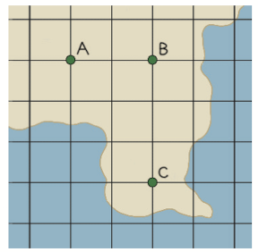
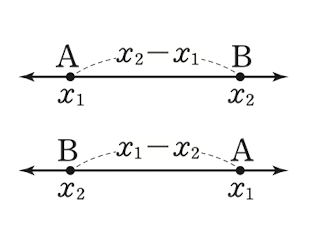
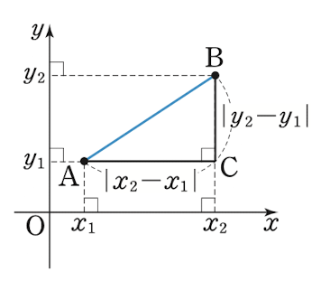

## 생각열기

두 점 사이의 거리는 어떻게 구할까?

1. 두 관광지 A, B 사이의 직선거리
2. 두 관광지 B, C 사이의 직선거리
3. 두 관광지 A, C 사이의 직선거리

## 생각열기

피타고라스의 정리 이용

---

 

## 두 점 사이의 거리(수직선)

두 점 $A(x_1), B(x_2)$ 사이의 거리

---

$x_1\leq x_2$일 때, $\overline{AB}=x_2-x_1$

$x_1>x_2$일 때, $\overline{AB}=x_1-x_2$

한번에 표현하면

$\overline{AB}=\lvert x_2-x_1\rvert$

## 보기

두 점 $A(-3), B(4)$ 사이의 거리

$\overline{AB}=\lvert 4-(-3)\rvert=7$

## 문제1. 다음 수직선 위의 두 점 사이의 거리를 구하시오.

(1) $\text{A}(1), \text{B}(5)$

(2) $\text{A}(-4), \text{B}(2)$

## 두 점 사이의 거리(좌표평면)

두 점 $A(x_1, y_1), B(x_2, y_2)$ 사이의 거리

## 두 점 사이의 거리(좌표평면)

---

$\overline{AC}=\lvert x_2-x_1\rvert$, $\overline{BC}=\lvert y_2-y_1\rvert$

$\overline{AB}^2=\overline{AC}^2+\overline{BC}^2=\lvert x_2-x_1\rvert^2+\lvert y_2-y_1\rvert^2$

$=(x_2-x_1)^2+(y_2-y_1)^2$

$\overline{AB}=\sqrt{ (x_2-x_1)^2+(y_2-y_1)^2 }$

## 좌표평면 위의 두 점 사이의 거리

$A(x_1,y_1), B(x_2, y_2)$

$\overline{AB}=\sqrt{ (x_2-x_1)^2+(y_2-y_1)^2 }$

## 좌표평면 위의 두 점 사이의 거리

$A(1,2), B(-1,4)$

$\overline{AB}=\sqrt{ \lbrace (-1)-1\rbrace ^2+(4-2)^2}=2\sqrt{ 2 }$

## 문제2. 다음 두 점 사이의 거리를 구하시오.

(1) $A(0, 2), B(4, -1)$

(2) $A(-1, -1), B(2, 1)$

## 예제1. 세 점 $A(0, -1), B(3, 3), C(7, 0)$을 꼭짓점으로 하는 삼각형 $ABC$는 어떤 삼각형인지 말하시오.

$\overline{AB}=\sqrt{ (3-0)^2+\lbrace 3-(-1)\rbrace^2 }=5$

$\overline{BC}=\sqrt{ (7-3)^2+(1-3)^2 }=5$

$\overline{CA}=\sqrt{ (0-7)^2+\lbrace (-1)-0\rbrace^2 }=5\sqrt{ 2 }$

---

$\overline{AB}=\overline{BC}$, $\overline{AB}^2+\overline{BC}^2=\overline{CA}^2$

$\therefore\ \angle B=90^\circ$

$\angle B=90^2$인 직각이등변삼각형

## 문제3. 세 점 $A(1, 2), B(0, -1), C(3, 0)$을 꼭짓점으로 하는 삼각형 $ABC$는 어떤 삼각형인지 말하시오.

답

## 생각열기

오른쪽 그림과 같이 직선 거리로 10 m 떨어진 두 지점 $A, B$에서 두 로봇 태백과 한라가 마주 보며 동시에 출발하였다. 로봇 태백은 10초에 2 m, 로봇 한라는 10초에 3 m를 이동한다고 한다.

1. 두 로봇 태백과 한라는 출발한 지 몇 초 후에 만나는지 말해보자
2. 두 로봇 태백과 한라가 만나는 지점을 $P$라고 할 때, $\overline{AP}:\overline{BP}$를 구해보자.

## 생각열기

$\overline{AP}:\overline{PB}=m:n\ (m>0, n>0)$

점 $P$는 선분 $AB$를 $m:n$으로 내분

내분점

## 내분하는 점의 좌표

두 점 $A(x_1), B(x_2)$에 대하여

선분 $AB$를 $m:n$으로 내분하는 점 $P(x)$의 좌표

## 내분하는 점의 좌표

$\text{i) }x_1<x_2$일 때, $x_1<x<x_2$이므로

$\overline{AP}=x-x_1$, $\overline{PB}=x_2-x$

$\overline{AP}:\overline{PB}=m:n$

$(x-x_1):(x_2-x)=m:n$

$\therefore\ x=\dfrac{mx_2+nx_1}{m+n}$

## 보기

두 점 $A(-1), B(5)$에 대하여

(1) 선분 $AB$를 $1:2$로 내분하는 점의 좌표는 

$\dfrac{1\times 5+2\times (-1)}{1+2}=1$

(2) 선분 $AB$의 중점의 좌표는

$\dfrac{(-1)+5}{1+1}=2$

## 문제4. 두 점 $A(-4), B(6)$에 대하여 다음 점의 좌표를 구하시오. 

(1) 선분 $AB$를 $3:2$로 내분하는 점

(2) 선분 $AB$의 중점

## 좌표평면 위의 선분의 내분점

$x$는 $x$끼리, $y$는 $y$끼리 *닮음이므로*

두 점 $A(x_1, y_1), B(x_2, y_2)$에 대하여

선분 $AB$를 $m:n$으로 내분하는 점

$\left(\dfrac{mx_2+nx_1}}{m+n}, \dfrac{{my_2+ny_1}}{m+n}\right)$

## 보기

두 점 $A(-1, 2), B(2, 5)$에 대하여

(1) 선분 $AB$를 $2:1$로 내분하는 점

$\left(\dfrac{{2\times 2+1\times (-1)}}{2+1}, \dfrac{{2\times 5+1\times 2}}{2+1}\right)=(1, 4)$

(2) 선분 $AB$의 중점의 좌표

$\left(\dfrac{{(-1)+2}}{2}, \dfrac{{2+5}}{2}\right)=\left(\dfrac{1}{2}, \dfrac{7}{2}\right)$

## 문제5. 두 점 $A(-3, 2), B(5, 6)$에 대하여 다음 점의 좌표를 구하시오. 

(1) 선분 $AB$를 $1:3$으로 내분하는 점

(2) 선분 $AB$의 중점

## 예제2. 세 점 $A(x_1, y_1), B(x_2, y_2), C(x_3, y_3)$을 꼭짓점으로 하는 삼각형 $ABC$의 무게중심 $G$의 좌표를 구하시오. 

단계1. 변 $BC$의 중점

$\left(\dfrac{{x_2+x_3}}{2}, \dfrac{{y_2+y_3}}{2}\right)$

---

단계2. 선분 $AM$을 $2:1$로 내분하는 점

점 $G(x,y)$는 선분 $AM$을 $2:1$로 내분하므로

$x= \dfrac{{2\times \dfrac{{x_2+x_3}}{2}+x_1}}{2+1}=\dfrac{{x_1+x_2+x_3}}{3}$

---

$y=\dfrac{{2\times \dfrac{{y_2+y_3}}{2}+y_1}}{2+1}=\dfrac{{y_1+y_2+y_3}}{3}$

$\therefore\ G\left(\dfrac{{x_1+x_2+x_3}}{3}, \dfrac{{y_1+y_2+y_3}}{3}\right)$

## 문제6. 세 점 $A(0, -1), B(7,-2), C(5, 6)$을 꼭짓점으로 하는 삼각형 $ABC$의 무게중심의 좌표를 구하시오. 

답