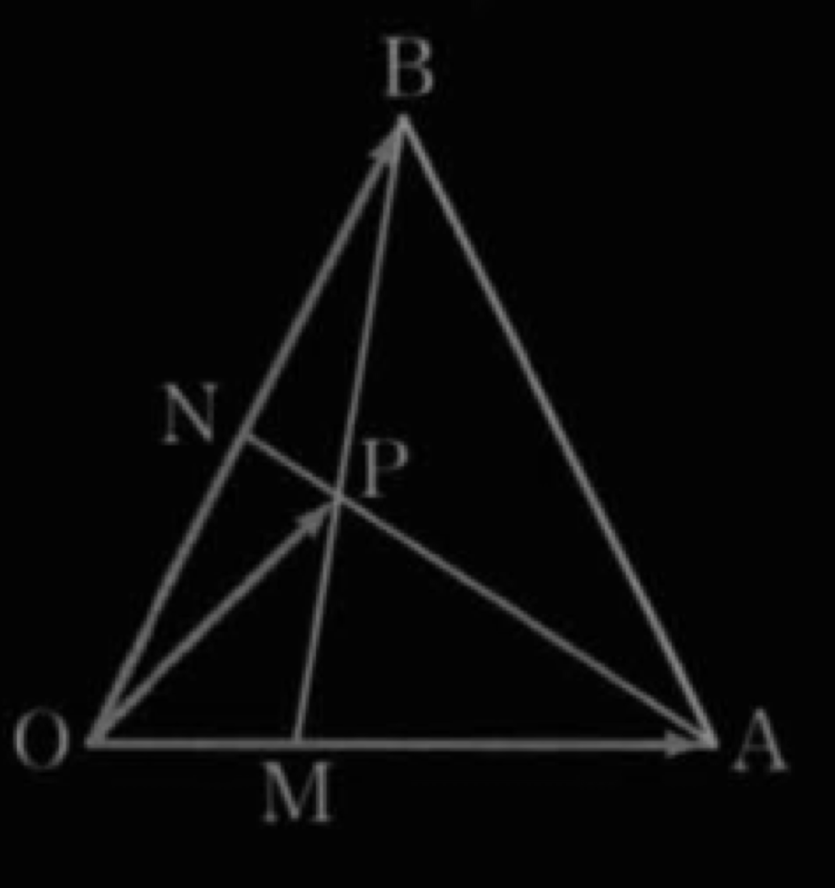

## *세 점이 한 직선 위에 있을 조건*

---

## *세 점이 한 직선 위에 있을 조건*

 $$\text{Let }\quad\vec{x}=\vec{OP},$$ 

 $$\qquad $$ $$\qquad $$  $$\vec{a}=\vec{OM}, \vec{b}=\vec{ON}$$

$$\vec{MP}//\vec{MB}$$이므로

$$\vec{x}-\vec{a}=k(2\vec{b}-\vec{a})$$

---

## *세 점이 한 직선 위에 있을 조건*

$$\vec{NP}//\vec{NA}$$이므로

$$\vec{x}-\vec{b}=t(\vec{3a}-\vec{b})$$

$$\begin{align}
\vec{x}&=(1-k)\vec{a}+2k\vec{b} \\
\vec{x}&=3t\vec{a}+(1-t)\vec{b}
\end{align}$$

$$\begin{align}
\therefore\ 1-k&=3t \\
2k&=1-t
\end{align}$$

---

## *세 점이 한 직선 위에 있을 조건*

연립하면 $$ t=\dfrac{1}{5}, k=\dfrac{2}{5}$$

$$\therefore\ \vec{x}=\dfrac{3}{5}\vec{a}+\dfrac{4}{5}\vec{b}$$

여기서 $$ 3\vec{a}=\vec{OA}, 2\vec{b}=\vec{OB}$$이므로

$$\vec{x}=\dfrac{1}{5}\vec{OA}+\dfrac{2}{5}\vec{b}$$
